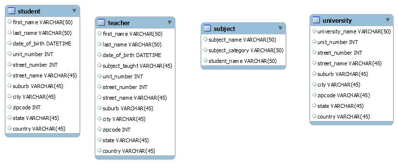
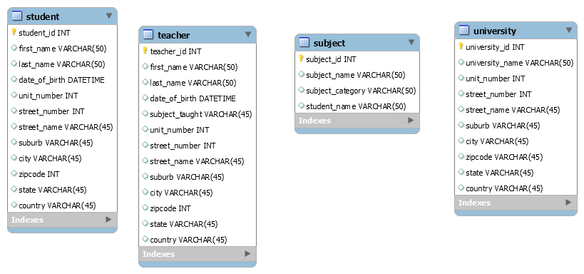
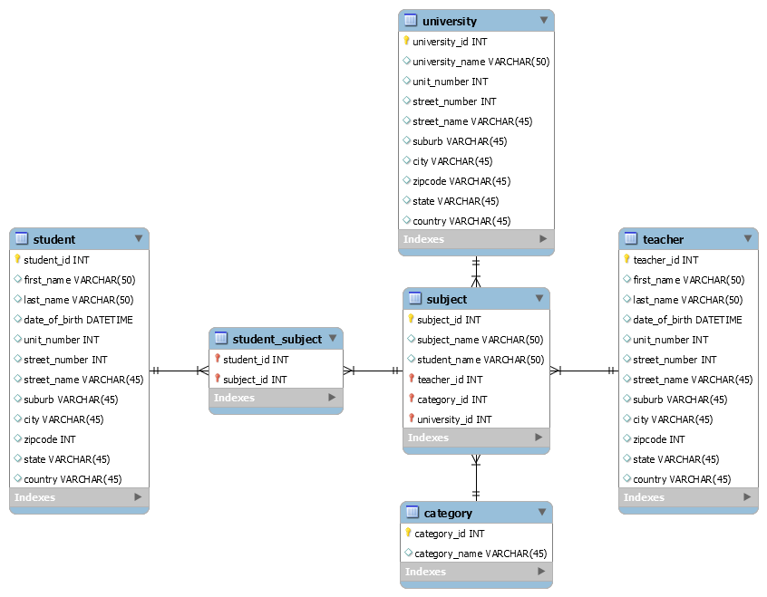
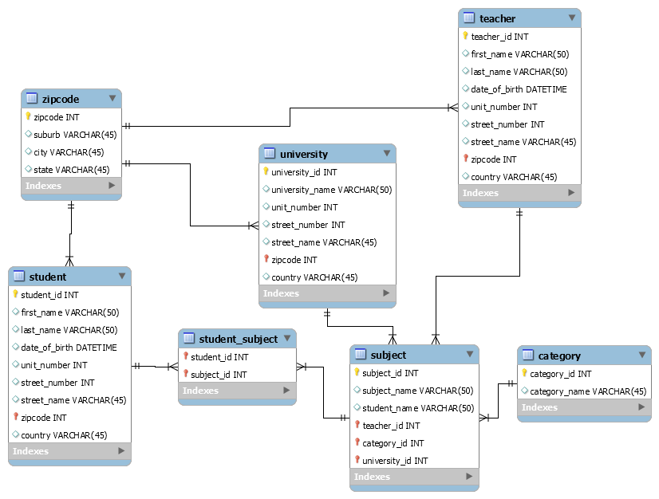

# A reference for Relational Database Design

* A simple MySQL Workbench based illustration of a Student Enrollment Database.
* Illustrating step-wise design from Basic to 1NF, 2NF and 3NF.

## Basic

## 1 NF

* Each set of columns must uniquely identify a row
* No 2 rows are duplicate
* Can be accomplished by adding a primary key

## 2 NF

* Must be in 1 NF
* No partial dependency
* Each non-key attribute must be functionally dependent on the primary key
* Functionally dependent means that the attribute is determined by the primary key; it is specific to that record
* Use foreign keys

## 3 NF

* Fulfill requirements of 2 NF
* No transitive functional dependency
* Such as A determines B which determines C
* When a non-prime attribute depends on other non-prime attributes rather than depending upon the prime attributes or primary key
* Move these to a separate table and reference the id